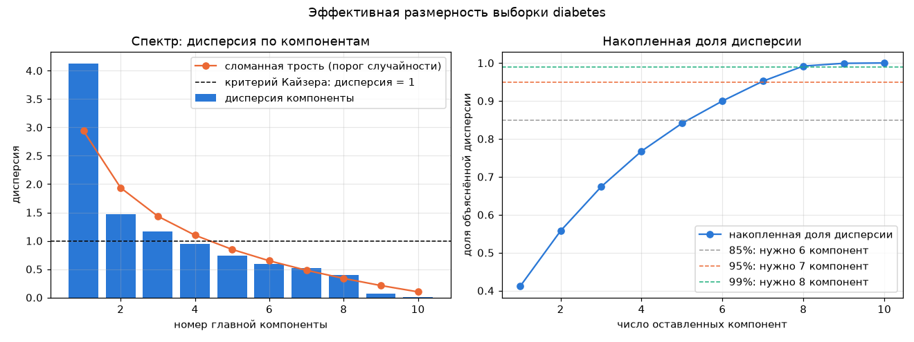
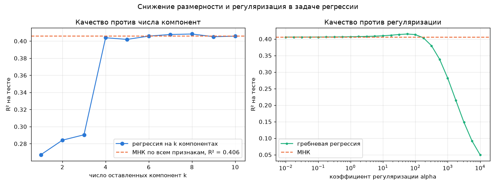

# Лабораторная работа №4. PCA

PCA через сингулярное разложение, эффективная размерность выборки, сравнение с `sklearn.decomposition.PCA` и применение к регрессии.

## Датасет

[Diabetes](https://www4.stat.ncsu.edu/~boos/var.select/diabetes.html) из `sklearn.datasets`: 442 пациента, 10 признаков (возраст, пол, индекс массы тела, давление и шесть показателей крови `s1`–`s6`), цель — прогрессирование болезни через год.

Взял его из-за мультиколлинеарности: показатели крови сильно связаны между собой, а это именно та ситуация, ради которой разбирали SVD и гребневую регрессию.

| пара | r |
|---|---|
| s1 и s2 | +0.895 |
| s3 и s4 | −0.750 |
| s2 и s4 | +0.669 |
| s4 и s5 | +0.632 |

Число обусловленности матрицы признаков 21.3. Разбиение случайное 70/30 (309 на обучение, 133 на тест), признаки стандартизованы по обучающей выборке.

## Запуск

```sh
uv run python source/main.py
```

## Структура кода

- `data.py` — загрузка, разбиение, стандартизация;
- `pca.py` — разложение, дисперсии, проекция и восстановление, критерии размерности;
- `regression.py` — МНК, гребневая и PCA-регрессия через SVD;
- `plots.py` — графики;
- `main.py` — эксперименты.

## PCA через SVD

Центрированная матрица раскладывается как $X - \bar{x} = U \Sigma V^{\mathsf T}$, строки $V^{\mathsf T}$ — главные оси, дисперсия вдоль $j$-й оси равна $s_j^2 / (n-1)$.

Через SVD, а не через собственные векторы ковариационной матрицы $C = \frac{1}{n-1}(X-\bar x)^{\mathsf T}(X-\bar x)$, потому что возведение матрицы в квадрат удваивает число обусловленности и теряет точность на малых направлениях.

Проверил свойства, на которых всё держится:

| свойство | расхождение |
|---|---|
| оси ортонормированы, $VV^{\mathsf T} = I$ | 8.9e-16 |
| проекции не коррелированы | 6.2e-16 |
| дисперсия проекций равна $s_j^2/(n-1)$ | совпадает |
| восстановление по всем осям точное | 3.6e-15 |

Ошибка приближения первыми $k$ компонентами совпала с суммой отброшенных дисперсий (теорема Эккарта–Янга): при $k = 8$ и то и другое 0.0816, при $k = 5$ — 1.5950.

## Эффективная размерность



| номер | 1 | 2 | 3 | 4 | 5 | 6 | 7 | 8 | 9 | 10 |
|---|---|---|---|---|---|---|---|---|---|---|
| дисперсия | 4.127 | 1.467 | 1.163 | 0.944 | 0.736 | 0.590 | 0.523 | 0.400 | 0.073 | 0.009 |
| доля | 0.411 | 0.146 | 0.116 | 0.094 | 0.073 | 0.059 | 0.052 | 0.040 | 0.007 | 0.001 |
| накопленно | 0.411 | 0.558 | 0.673 | 0.768 | 0.841 | 0.900 | 0.952 | 0.992 | 0.999 | 1.000 |

| критерий | ответ |
|---|---|
| 85 % дисперсии | 6 |
| 95 % дисперсии | 7 |
| 99 % дисперсии | 8 |
| Кайзера (дисперсия > 1) | 3 |
| сломанная трость | 3 |

Критерии расходятся, потому что отвечают на разные вопросы. Кайзер и сломанная трость показывают, сколько осей несут структуру, а не шум, — это 3 компоненты. Порог по доле дисперсии показывает, сколько осей нужно, чтобы почти ничего не потерять, — это 8.

Содержательный ответ для этой выборки — **8**: девятая и десятая компоненты вместе дают 0.8 % дисперсии и являются прямым следствием корреляции `s1` с `s2`. Отбросив их, число обусловленности падает с 21.3 до 3.2.

Оговорюсь, что критерий сломанной трости я посчитал как общее число компонент, у которых доля выше порога, хотя задуман он как длина начальной серии. На этих данных результат совпал (3 компоненты), но в общем случае это разные числа.

## Эквивалентность с эталоном

`PCA(svd_solver="full")` на тех же данных:

| что сравниваем | расхождение |
|---|---|
| `mean_` | 0 |
| `singular_values_` | 0 |
| `explained_variance_` | 0 |
| `explained_variance_ratio_` | 1.4e-17 |
| `components_` (с учётом знака) | 0 |
| `transform()` на тесте | 4.4e-16 |
| `inverse_transform()` при k = 2, 5, 8 | 4.4e-16 |

Ноль, а не «близко»: обе реализации вызывают один и тот же драйвер LAPACK через `np.linalg.svd`. Отличия 1e-16 возникают там, где есть дополнительная арифметика (деление на сумму, умножение матриц).

У трёх осей из десяти знак противоположный. Это не ошибка: $v$ и $-v$ задают одну и ту же прямую, SVD определён с точностью до знака. sklearn дополнительно фиксирует знак (`svd_flip` делает максимальный по модулю элемент положительным) ради воспроизводимости вывода, на результат это не влияет — при обратном преобразовании знак сокращается.

## Применение к регрессии

Решение через SVD: $w = \sum_j f_j \frac{u_j^{\mathsf T} y}{s_j} v_j$. Три метода отличаются только фильтром $f_j$:

| метод | $f_j$ |
|---|---|
| МНК | 1 |
| гребневая | $s_j^2 / (s_j^2 + \alpha)$ |
| PCA-регрессия | 1 при $j \le k$, иначе 0 |

Поэтому в коде это одна функция с двумя параметрами.



| k | R² обучение | R² тест | RMSE тест | ‖w‖ |
|---|---|---|---|---|
| 1 | 0.3199 | 0.2671 | 64.90 | 21.55 |
| 3 | 0.3873 | 0.2904 | 63.86 | 27.57 |
| 4 | 0.5353 | 0.4039 | 58.53 | 41.22 |
| 6 | 0.5495 | 0.4059 | 58.44 | 42.87 |
| 8 | 0.5502 | 0.4083 | 58.32 | 42.99 |
| 9 | 0.5512 | 0.4052 | 58.47 | 43.92 |
| 10 | 0.5559 | 0.4058 | 58.44 | 70.92 |

| модель | R² на тесте |
|---|---|
| МНК по всем признакам | 0.4058 |
| PCA-регрессия, k = 8 | 0.4083 |
| гребневая, α = 56.2 | 0.4152 |

Последняя компонента улучшает R² на обучении (0.5512 → 0.5559), но не на тесте, зато норма весов подскакивает с 44 до 71. Это и есть вред почти вырожденного направления: в формуле стоит деление на $s_j$, а $s_{10} = 1.67$ против $s_1 = 35.65$, поэтому шум вдоль этой оси раздувается в весах.

Гребневая регрессия работает чуть лучше жёсткого обрезания — мягкий фильтр не выбрасывает направление целиком, а взвешивает его по надёжности.

## Выводы

1. PCA реализован через SVD, все его свойства (ортонормированность осей, некоррелированность проекций, связь дисперсий с сингулярными числами, точность восстановления) выполняются с машинной точностью.
2. Разложение совпадает с `sklearn.decomposition.PCA` точно, отличается только знак трёх осей, что является неустранимой неоднозначностью SVD.
3. Эффективная размерность выборки — 8 из 10: две последние компоненты несут 0.8 % дисперсии и возникают из-за корреляции `s1` и `s2` на уровне 0.895. Их удаление улучшает обусловленность в 7 раз.
4. В регрессии плато качества начинается с 4 компонент: R² = 0.404 против 0.406 у полного МНК при 40 % исходного пространства.
5. PCA не знает про целевую переменную, поэтому порядок компонент по дисперсии не совпадает с порядком по полезности для предсказания: четвёртая компонента дала основной прирост R² (0.29 → 0.40), хотя по дисперсии она только пятая по величине.
6. Выигрыш PCA-регрессии над МНК (0.0025 по R²) лежит в пределах шума на тесте из 133 объектов. Реальная польза не в качестве, а в устойчивости: норма весов меньше в 1.6 раза.
